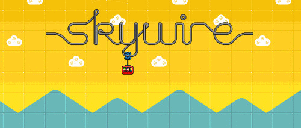
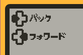
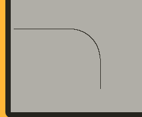
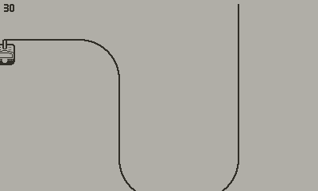

# Beginning

I read a lot of advice for gamedev that says things like: "You should write dev logs for your work". Well, here we go!
I'm a bit late, writing this retroactively - I didn't think of writing the blog until just now. (The editor is mostly complete as of writing).

I've been through many random prototypes, but ran into various stumbling points. I wanted to actually *get something done*, so I racked through my brain to think of a project I know from start-to-finish, I won't run into weird issues or rather annoying maths.

And there, at the back of my mind. A flash game I played in my childhood. 



(Skywire, by Nitrome games)

You're in a little cable car, and your goal is to bring your three passengers to the end. Well, this seems like it'd fit the Playdate fantastically. The crank might make for a great method to control the cablecar! I loved the game as a kid, but I won't be replaying it before making this game. I want it to be an inspiration, not a clone, or rip off, or whatever you'd call it. 

Alright, let's get started!

## Engine choice

Well, there's not much choice in this field. The Playdate is pretty simple, and *to my knowledge* there's one 'engine' available for Lua - [Noble Engine](https://github.com/NobleRobot/NobleEngine). There's also some small other utility libraries available, but Noble Engine covers most of the stuff that I don't want to deal with - scene management, settings/savegames, and, handily, comes with a font that supports japanese. 



(*Japanese text example. Input prompts are from the Kenney 1-bit input prompts pack*)

Noble engine comes with a project template, featuring a couple of example scenes, and a demo of how to use the menu system.

## Initial commit

Let's start by getting in the two most important things: The player, and the cable.

### Our track

For the cable, this is pretty simple! The Playdate has the `playdate.geometry` library, which has handy things like line segments and arcs. So we'll be composing those together to form our cable.

For this, I opted to plonk some simple objects into a list. Because it's Lua, we can go for a simple, quick design:
```lua
local ARC <const> = 1
local LINE <const> = 2
function DebugPath()
    return {
        {
            Type = LINE,
            Line = playdate.geometry.lineSegment.new(5,100,100,100)
            -- x1, y1, x2, y2
        },
        {
            Type = ARC,
            Arc = playdate.geometry.arc.new(100,150,50,0,90) 
            -- x, y, radius, startAngle, endAngle
        },
        {
            Type = LINE,
            Line = playdate.geometry.lineSegment.new(150,150,150,200)
        },
    }
end
```

and then when we want to draw our path, it's as simple as:

```lua    
for _, value in ipairs(array) do
    if value.Type == ARC then
        gfx.drawArc(value.Arc)
    elseif value.Type == LINE then
        gfx.drawLine(value.Line)
    end
end
```

and that gets us this!



### The player

Next up, lets get ourselves a player onto the game. The playdate has a sprite library, `CoreLibs/sprites`, which Noble Engine extends further. We'll be using that, along with the Playdate's simple object-orientation system.

```lua
import "CoreLibs/object"

class("Player").extends(NobleSprite)


function Player:init()
    Player.super.init(self, "assets/images/spr_cablecar")
    self:setCenter(0.5,0)
end
```

To do our regular ol' drawing functions alongside sprites, we need to either draw them to a sprite ourselves, or use the convenience `setBackgroundDrawingCallback`. We'll be going with the latter, as we want the cable to draw behind our player anyway.



(At this point, I've also set the line width to 2, so we have a thicker cable. We're using for our player sprite an edit of the cablecar from Kenney's Tiny Ski assets.)
 
Next up: [**More player movement stuff**](./movement)!
 

### Credits

- [Skywire](http://www.nitrome.com/games/skywire/)
- [1-bit Input prompts pack - kenney.nl](https://kenney.nl/assets/1-bit-input-prompts-pixel-16)
- [Edited assets of Tiny ski - kenney.nl](https://kenney.nl/assets/tiny-ski)