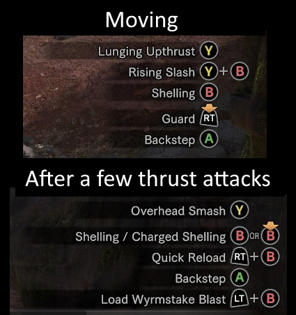

### The inbetween

We've had a few small improvements inbetween that I didn't feel were interesting enough to warrant a section in the post. The main small one being a camera system. It just manipulates the Playdate's `drawOffset`.

# Editor - 1

From the start, I planned to have a level editor for the game. And what would be the best way to ensure the level editor is fully featured? Make it the thing you'll make the actual levels for the game in, of course.

## Architecture

A level editor will have many inputs, varying in what they do all the time. Different modes, all that kind of nonsense. So I wanted to do something that'd be simple to add features to, without the potential for those features to be confusing to players. How can you present a complex control set to players in a simple way?

### Control hints

Control lists are useful, so long as you can remember all the controls and all the contexts you'd use each of them in. So in an editor in which you have a bunch of different contexts, telling you all the many different controls at once won't work if you can't keep it mentally together.

I got my inspiration for how to solve this from *Monster Hunter: World*. Some of the weapons in that game can have quite complex movesets, with many different followups available depending on where you are in your combo, whether you're moving or standing still, powered up, and such.



(An example of the control hints available for the Gunlance. I'd've used my beloved hunting horn, but it doesn't make the best example for this. So the second favourite it is then.)

### The design

So, to design this, we'll have:

- A set of modes the editor can be in. This includes things such as Viewing, Placing lines, Placing arcs, Editing objects, Placing objects, Moving objects. For our convenience, this is an enum-like table.
- An input map for each mode. This has both the function called when the relevant input is used, along with a short (localizable) text description of what it does. 
- A set of generated images for each mode that have the input prompts with the text description that goes with the prompt.

Here's an example of what we're going for here:


and we'd end up with something like this:

```lua
...
A = {
    fn = function (scene)
        ...
    end,
    desc = "editorPlace"
},
B = {
    fn = function (scene)
        scene:ChangeMode(MODES.VIEW)
    end,
    desc = "editorBackToView"
},
-- etc
```

Once again, this is something we could pre-generate or pre-render, but it's easier to just do it in-engine (at least for now). For simplicity, we're going to generate them all at init, though we can change it to lazy-loading later. 

So we can iterate through each of the modes, check its input map, draw icons & text for any defined inputs, and then associate that image with the mode. To put it simply;

```
for each editor_modes:
    create an image, roughly big enough for our control hints
    begin drawing onto our image
    for each input in the editor_mode's input_map:
        draw the icon
        draw the text next to it
    stop drawing onto our image
    save the image into the control hint map for the editor_mode
```

though that'll mean the icons are in the order they're defined in the input map. It could be what you want, but I'd rather keep them consistent. So instead: 

```
for each editor_modes:
    create an image, roughly big enough for our control hints
    begin drawing onto our image
    for each key in A, B, Up, Down, ... etc:
        if the input map for our mode has a handler for that key:
            draw the icon
            draw the text next to it
    stop drawing onto our image
    save the image into the control hint map for the editor_mode
```

Noble Engine's text drawing function will handle localization for us, so now, with this:

```lua
[MODES.VIEW] = {
    L = { 
        fn = function (scene)
            ...
        end,
        desc = "editorLeft"
    },
    R = { 
        fn = function (scene)
            ...
        end,
        desc = "editorRight"
    },
    U = {
        fn = function (scene)
            ...
        end,
        desc = "editorUp"
    },
    D = {
        fn = function (scene)
            ...
        end,
        desc = "editorDown"
    },
    A = {
        fn = function (scene)
            ...
        end,
        desc = "editorBuildRail"
    },
    B = {
        fn = function (scene)
            ...
        end,
        desc = "editorPlaceObjects"
    },
},
```

We get this when we're in the VIEW mode!


Next up: [**More on the level editor**](./editor_2.md).

### Credits

- [1-bit Input prompts pack - kenney.nl](https://kenney.nl/assets/1-bit-input-prompts-pixel-16)