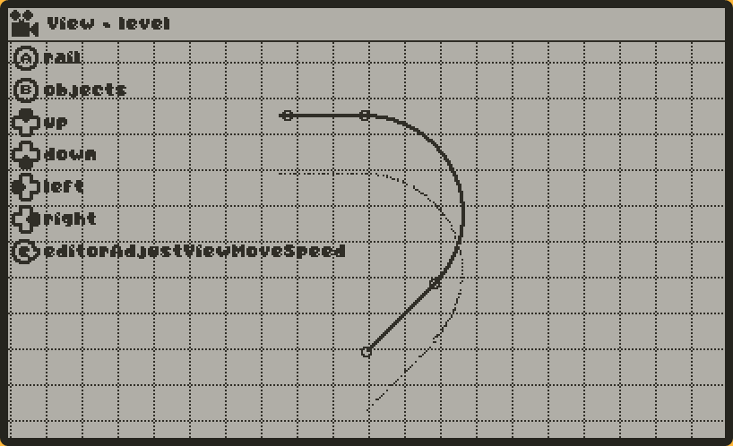
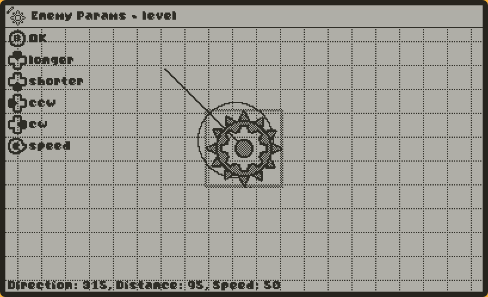

# Editor - part 2

As of the last post, we have our control hints, but what will we actually *do* to make the editor work? We have 6 buttons, a crank and the pause menu to work with. Well, this is where the Editor file starts to grow. 

Editor modes will have some special graphics requirements (hover selection for objects, preview for placing lines/arcs, that kind of thing). So in a similar vein to the input handlers, modes will also have an associated:

- Update function
- Draw function

Really quickly. We write out all our relevant modes, the controls & draw-functions for them, and start to program how they will work. (I'm sorry, this is a lie, I programmed this as I went. But claiming I planned it makes for a better blog post, right? 😉)

#### View:
- Look around
- Can swap to placing cable, and placing objects.
#### Building the cable:
- Start a line
- Start an arc
- Edit a segment
- Delete a segment
- Back to view
#### Placing a line:
- Move placement cursor around
- Finalize line
- Go back to building
- Will draw a thinner 'in-progress' line to preview the placement
#### Placing an arc:
- Rotate the arc's radius
- Enlarge the arc's radius
- Adjust the arc's angle
- Finalize arc
- Go back to building
- Will draw a thinner 'in-progress' arc to preview the placement
#### Placing objects:
- Move placement cursor around
- Place object
- Scroll object list
- Will draw a blurred preview of the selected object
#### Move object
- Move selected object around
- Delete object
- Go back to object placement
- Will draw the object's hover-specific editor info
#### Object parameters
- This one's special! More on this later...!
- Will draw the object's hover-specific editor info

Now this would be excessively boring to write in-depth about. So I'll just simplify it down: We make a few convenience functions for shared functionality (changing mode, moving the cursor, that kinda thing).

A grid is added into the background, a label & icon for the current mode we are in, and a shadow below the track to show how low the player hangs. Looking nice!

Obstacles in our game will have a bunch of different parameters and they aren't always going to share them. Some objects may move along a fixed line, whereas some may just rotate in place, or some could fire projectiles. We can't just make a generic "Object parameter" editor, because that could easily become unwieldy. Instead, we'll be allowing each editor object to define an input handler for adjusting it's parameters.

Editor-usable objects have a static method, `.editor()`, which provide everything the editor needs to know about the object. Input map, a picture, display name and such. We also have some functions for editor-specific data display.

We have to go back to our controls hints, and add a special case for object parameters. Instead of generating a control hint for that, we instead go through each of the objects the editor has access to, and generate a control hint image for it.

(The editor specific drawing lets us see where this object will move, and the speed it will move at. We can also view the specific values on the bottom left.)

A short one this time, but now I'm caught up on the blog to where I"m actually at now - the hard part - designing all the enemies. It's a pretty different topic so I'll be covering that in the next post - [**Enemy designs.**](./enemy_designs)

### Credits

- [1-bit Input prompts pack - kenney.nl](https://kenney.nl/assets/1-bit-input-prompts-pixel-16)