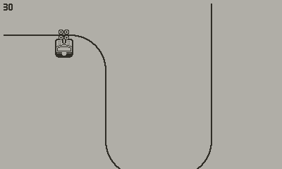
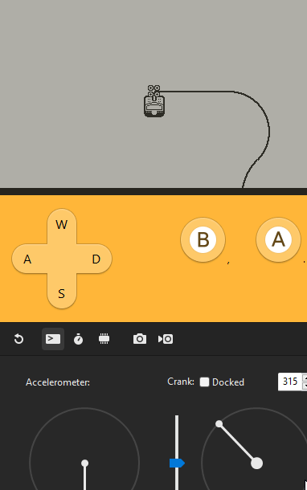
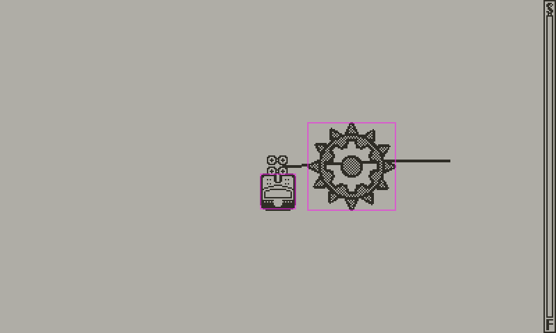

# Phase two: Player movement

So, to recap: We have our cable, made up of a list of `lineSegment|arc`. We have our player, but we can't move just yet. We need to have a few things:

- Where we are along the overall cable
- Where we are along the individual segment

The first is simple. It's just an index, our position on the list of cable segments. The second? Well, that's also nice and easy to deal with. `lineSegment`s and `arc`s have `:pointOnLine(...)` and `:pointOnArc(...)` respectively, which we can use to get a point at a certain distance along the line/arc.

```lua
-- PointOnSegment
if segment.Type == ARC then
    return (segment.Arc:pointOnArc(progress))
elseif segment.Type == LINE then
    return (segment.Line:pointOnLine(progress))
end
```

For this to work, we also need to know how large the specific segment is, in pixels. We'll be calculating this as the game loads right now, while we're still using a dev test course, but in the future it'll just get calculated and saved when the level is made and loaded when the level is. 

```lua
for _, value in ipairs(array) do
    if value.Type == ARC then
        value.Length = value.Arc:length()
    elseif value.Type == LINE then
        value.Length = value.Line:length()
    end
end
```

So now, with our distance along a line, and knowledge of how long the line is, we know where we are in the course! We can wire up a simple input handler, along with some rather messy "where-are-we" code...



(I also added some wheels to our cablecar.)

There we go, movement!

### Gravity

Going up a cable should require more effort. Going down a cable should be risky but quick! So we need some gravity, and perhaps some friction too.

For this, we should know if the cable is sloped. This is pretty simple actually, with our `PointOnSegment` function. We can just take a point 1 pixel after and subtract the point 1 pixel before our current position. This gives us a vector parallel with our current line segment.

We can then take the absolute value of the Y component of this vector, and we get our slope's intensity! Depending on if that Y is negative or positive, we add/subtract the gravity times the intensity to our speed, and voilà! Gravity!

Then we can just multiply our current speed by a Rather-small-number™️ for some friction. Took a bit of tweaking, but eventually I found a number that felt just right.



(The cablecar wheels use the same method to determine direction as gravity does! Nice and simple. We also have camera movement. That wasn't actually there at this point, I just couldn't be bothered to checkout an older version to make this gif. And it shows off the gravity better anyway.)

### Spring cleaning

So now, I move our player speed control out of the general input handler and into a method on the player object. We don't want to let our player move too quickly, but we also want gravity to be able to pull us a little bit faster than our normal maximum movement speed.

## Objects/Enemies

Objects/Enemies are pretty similar to what we're doing with the player - we make an 'EnemyBase' that extends NobleSprite, where we'll be putting shared functionality for objects.

We set a collision mask on all of our enemies, and on our player, so the engine will only check for collisions between the player and an enemy (no enemy-enemy collisions are needed). We check for collisions initially with a bounding box, and then if that passes we use `sprite:alphaCollision(other)` to check if the images actually overlap. If they do, ouch! We've just hit the sawblade.



(The Sawblade dev asset. Shoddily drawn in Paint.NET by yours truly.)

Next up: [**Beginning work on the editor!**](./editor)

### Credits

- [Edited assets of Tiny ski - kenney.nl](https://kenney.nl/assets/tiny-ski)